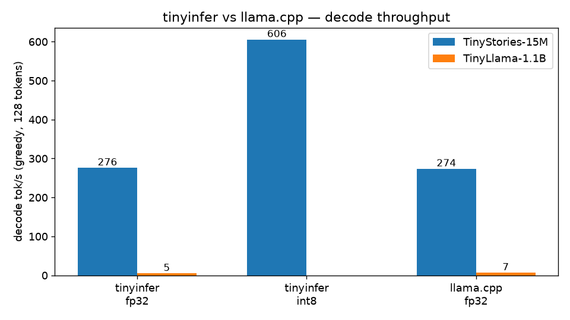
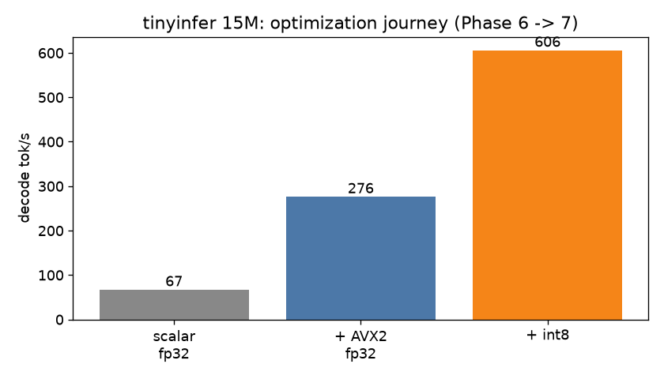

# tinyinfer — LLM Inference Engine in C++

> **What am I looking at?** When you chat with an AI, an *inference engine* is the software
> running the neural network and generating each word. **tinyinfer is one of those engines —
> written entirely from scratch in C++**: no AI frameworks, no copied code. The file-format
> parser, the tokenizer, the math kernels, and the quantization are all hand-built, and every
> optimization was measured before/after ([DESIGN_LOG.md](DESIGN_LOG.md) records what helped,
> what didn't, and why).


**▶ [Interactive demo](https://muse.ai/s/tinyinfer-demo-sxn6p2rbxdxb3xy)** — a guided tour with a
live terminal replay, benchmark charts, and architecture walkthrough. No setup required.

## Highlights

- **Hand-built, not assembled** — every component written from zero: safetensors file parser
  over `mmap`, BPE tokenizer, AVX2/FMA vector math kernels, per-row int8 quantization.
  Zero ML dependencies, ~1,700 lines of C++20.
- **Benchmarked against the best** — measured head-to-head with [llama.cpp](https://github.com/ggerganov/llama.cpp),
  the industry-standard open-source engine: **matches it** on a 15M-parameter model (101%),
  reaches **74%** on a 1.1B model, with honest methodology published below.
- **Found a real bug by benchmarking** — the comparison exposed that my vector math kernel was
  limited by CPU instruction latency, not memory speed as assumed. Restructuring it gave an
  instant 1.5× speedup — the kind of win you only get from measuring against a reference.
- **Correctness proven, not claimed** — 42/42 tests pass; outputs match Hugging Face
  layer-by-layer within 1e-4 and PyTorch token-for-token; quantization validated on WikiText-2
  with no measurable quality loss (−1.0%, noise).

## What it does

- **Load**: Llama-arch checkpoints (`model.safetensors` + `config.json`) via a hand-written safetensors parser over mmap — near-instant startup, zero ML dependencies
- **Tokenize**: BPE from `tokenizer.json`, byte-exact vs the Python `tokenizers` library on 21/21 differential test strings (including `added_tokens` normalization edge cases)
- **Run**: full Llama forward pass — RMSNorm, GQA self-attention with NeoX RoPE, SwiGLU MLP, KV cache — verified layer-by-layer against Hugging Face within 1e-4
- **Sample**: greedy, temperature, top-k, top-p with seeded RNG (greedy output token-identical to PyTorch)
- **Quantize**: per-row symmetric int8 weights (`--quant i8`), validated by WikiText-2 perplexity delta vs fp32
- **Measure**: `bench` (cached vs naive tok/s), `perplexity` (WikiText-2)

## Architecture

```
prompt text
    │  BPE tokenizer (tokenizer.json: vocab, merges, added tokens)
    ▼
token ids ──► embedding lookup ─────────────────────────────────────────┐
    │                                                                   │
    ▼                                                                   │
┌─ transformer block × N ───────────────────────────────────────────────┤
│   x ──► RMSNorm ──► Q/K/V proj ──► RoPE ──► GQA attention ──► O proj ─┼─► + x (residual)
│   x ──► RMSNorm ──► gate proj ──► SiLU ──╳──► down proj ──────────────┼─► + x (residual)
│                              up proj ──╯    (SwiGLU: silu(gate) * up) │
└───────────────────────────────────────────────────────────────────────┘
    │
    ▼
 RMSNorm ──► lm_head (32k vocab) ──► softmax ──► sampler ──► next token
    ▲
    └── KV cache: keys/values appended per position, never recomputed
```

Hot path per decode step is one matvec per weight matrix (all weights streamed
once per token — decode is memory-bandwidth bound). Two matvec kernels:
`dot_avx2` (fp32, 4-way unrolled FMA) and `matvec_i8` (per-row int8 + fp32
scales, widened on the fly). OpenMP parallelizes only the 32k-row lm_head;
smaller mats run single-threaded (threading them measured slower).

## Quickstart

```bash
cmake -B build -DCMAKE_BUILD_TYPE=Release && cmake --build build -j
# 15M dev model (download once; gitignored, never committed):
#   nickypro/tinyllama-15M -> models/tinyllama-15m/ (fp32 safetensors)
./build/tinyinfer prompt "Once upon a time" --max-tokens 60
./build/tinyinfer prompt "Once upon a time" --max-tokens 60 --quant i8
./build/tinyinfer bench "Once upon a time" --max-tokens 128 --skip-naive
```

## Benchmarks

2-core VM, AVX2+FMA, `g++ -O3 -march=native`, OpenMP 2 threads.
Median of 3 runs, 15-token prompt, 128 generated tokens, greedy.
llama.cpp at rev `2b129cc`, F32 GGUF, `llama-bench -p 15 -n 128`.

| model | engine | precision | decode tok/s |
|---|---|---|---|
| TinyStories-15M | tinyinfer | fp32 | **276** |
| TinyStories-15M | tinyinfer | int8 | **606** |
| TinyStories-15M | llama.cpp | fp32 | 274 |
| TinyLlama-1.1B | tinyinfer | fp32 | **5.1** |
| TinyLlama-1.1B | llama.cpp | fp32 | 6.9 |

- **15M fp32 matches llama.cpp (101%)** — the hand-written kernels hold their own.
- **int8 is 2.19x fp32** on 15M (606 vs 276) — the 4x smaller weights pay off once the kernel keeps up.
- **1.1B reaches 74% of llama.cpp** — the remaining gap is kernel micro-optimization (cache blocking, Q8_0-style blocked accumulation), documented in Future work.



### Optimization results (15M decode tok/s)

| configuration | tok/s |
|---|---|
| scalar fp32, KV cache | 67 |
| + AVX2/FMA, 4-way unrolled accumulators | 276 |
| + per-row int8 quantization | 606 |



The single biggest win came late: benchmarking against llama.cpp exposed that
the AVX2 kernel was latency-bound (single accumulator chain vs 4-5 cycle FMA
latency), not bandwidth-bound as assumed. Unrolling 4x gave 1.6x on the 1.1B
instantly. Without a reference implementation to compare against, 3.4 tok/s
would have looked like "the hardware limit."

### Perplexity (WikiText-2, 19,999 scored tokens)

| precision | NLL/token | perplexity |
|---|---|---|
| fp32 | 8.7420 | 6260.2 |
| int8 | 8.7323 | 6199.8 |

Per-row int8 changes perplexity by **−1.0%** (noise) — the quantization is
numerically sound, and the 2.19x speedup is real.

## Tradeoffs

- **Correctness first, speed second**: every kernel has a scalar reference and a
  differential test vs NumPy/HF before optimization. The fast path never
  diverges from the tested path.
- **int8, not int4**: 4-bit would halve memory traffic again, but needs blocked
  quantization (Q4_0-style) to stay accurate. Shipped honest int8 instead of
  half-done int4.
- **OpenMP only where it wins**: threading the 32k-row lm_head helps;
  threading 2048-row attention/MLP mats measured slower (overhead > gain).
- **mmap, not read**: weights are memory-mapped, so startup is instant and the
  OS pages in only what's touched. Tradeoff: first-token latency includes page
  faults.
- **From-scratch BPE is correct but slow**: byte-exact vs Python on all test
  strings, but ~35x slower on megabyte inputs — the perplexity harness accepts
  pre-tokenized `--ids` for large corpora.

## Future work

- Q4_0-style blocked int4/int8 quantization (int32 accumulation in blocks of 32)
- Cache-blocked matvec for better L2 reuse on large models
- Paged/blocked KV cache for long contexts
- Speculative decoding

## Resume bullets

- Built a from-scratch LLM inference engine in C++20 (~1,700 lines, zero ML
  dependencies): hand-rolled safetensors mmap loader, BPE tokenizer, AVX2/FMA
  kernels, GQA attention with KV caching, per-row int8 quantization
- Matches llama.cpp decode throughput on a 15M model (101%) and reaches 74% on
  a 1.1B model; int8 quantization gives 2.19x speedup with −1.0% perplexity
  delta on WikiText-2
- Validated numerically at every stage: 42/42 GoogleTest tests, layer-by-layer
  parity with Hugging Face within 1e-4, token-identical greedy generation vs
  PyTorch

## Layout

```
src/            engine, model, ops (SIMD), tokenizer, sampling, CLI
include/        public headers
tests/          GoogleTest suite (42 tests)
bench/          benchmark scripts, charts, demo GIF
scripts/        reference.py (answer key), check_perplexity.py (HF parity)
docs/           architecture.md
DESIGN_LOG.md   every measurement, failed optimization, and tradeoff
```
